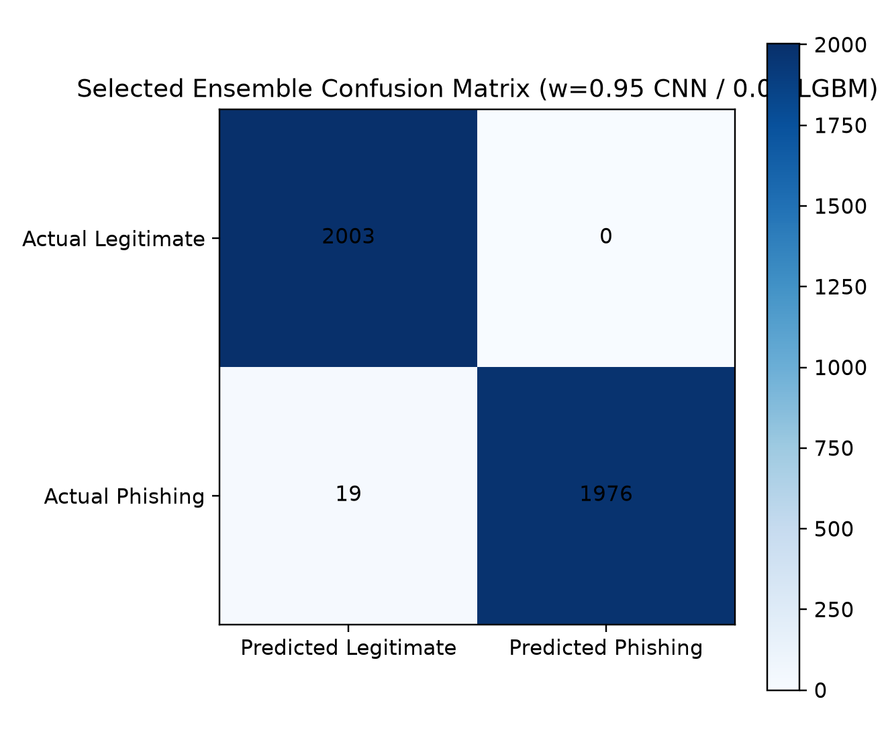
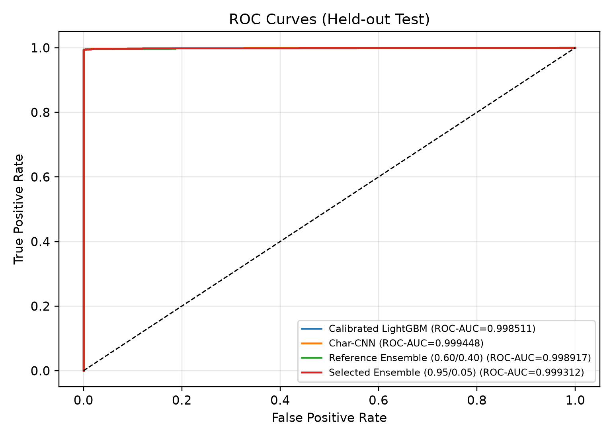
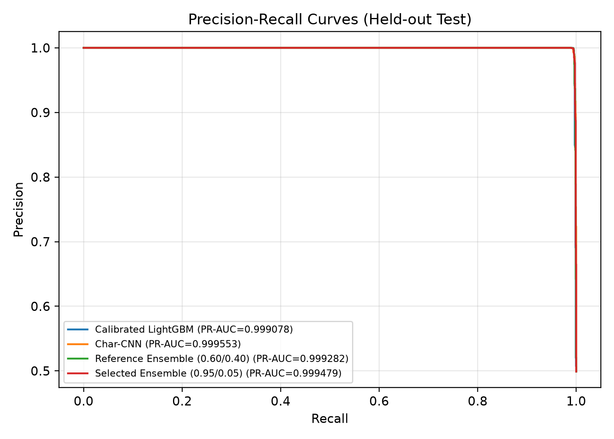
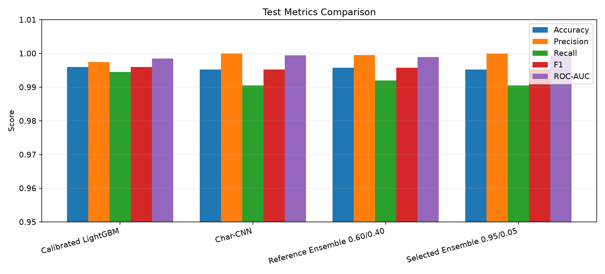
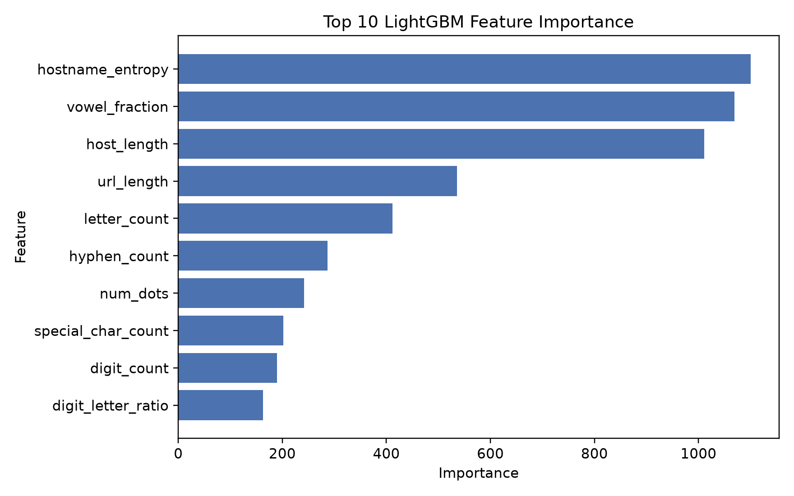
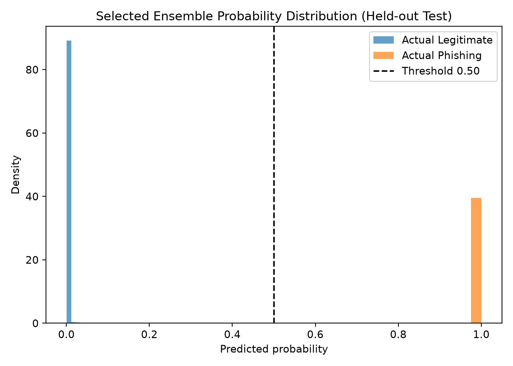
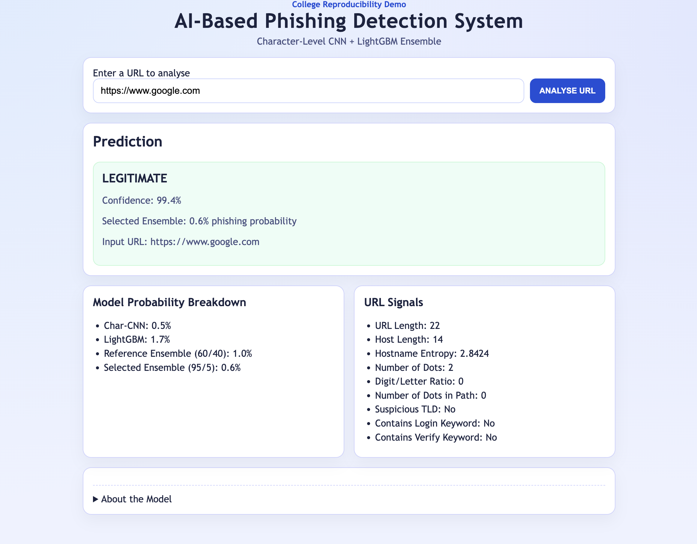
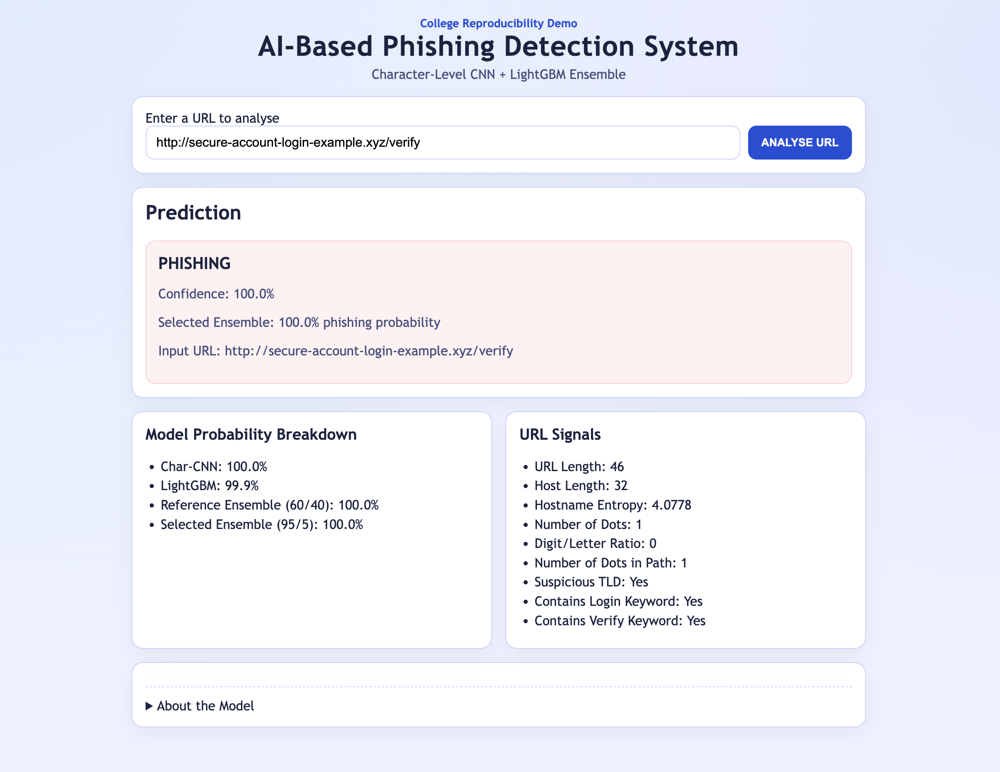

# AI-Based Phishing Detection System Using Ensemble Learning

## 1. Title Page

**Project Title:** AI-Based Phishing Detection System Using Ensemble Learning<br>
**College:** KLH Bachupally<br>
**Department:** DEPARTMENT OF CSIT<br>
**Team:**<br>
2320090017 — D Sunidhi<br>
2320090060 — P Manvitha<br>
2320090069 — G Likith<br>
**Project Guide:** Dr. K Venkateshwara Rao<br>
**Academic Year:** 2026 - 2027

---

## 2. Abstract

Phishing remains a significant cybersecurity threat because a deceptive Uniform Resource Locator (URL) can imitate a legitimate service and direct users to a fraudulent website. Conventional blacklist and rule-based defenses are useful for known threats, but they may fail when an attacker creates a previously unseen URL or modifies lexical details to avoid fixed rules. This project investigates a machine-learning approach that classifies a URL without visiting it. The system combines a Character-Level Convolutional Neural Network (Char-CNN), which learns sequential patterns directly from URL characters, with a Light Gradient Boosting Machine (LightGBM), which uses 36 explicitly engineered lexical, structural, and statistical URL features.

The work is an independent, limited-compute reproduction of the core hybrid methodology described by the reference PhishX study. A deterministic balanced subset of 20,000 URLs was constructed from frozen public dataset snapshots, with 10,000 legitimate and 10,000 phishing examples. Root-domain-separated train, validation, and test partitions were used to prevent URLs associated with the same registered domain from leaking across experimental splits. Ensemble weights were selected using validation receiver operating characteristic area under the curve (ROC-AUC) before the test set was inspected. On the final held-out test set of 3,998 URLs, the selected ensemble achieved 99.525% accuracy, 100% precision, 99.048% recall, and 99.931% ROC-AUC. These values are results from this local reproduction and must not be confused with those reported by the reference study.

A local real-time demonstration application was implemented with FastAPI, HTML, CSS, and vanilla JavaScript. It applies the same saved preprocessing and models used in the experiment while treating every submitted URL solely as text. The application never opens or fetches the submitted address. The study demonstrates that a compact hybrid URL classifier can achieve strong held-out performance on limited local hardware while retaining reproducible data, split, model, and evaluation artifacts.

## 3. Introduction

Phishing is a form of social engineering in which an attacker impersonates a trusted organization or service to persuade a victim to disclose credentials, payment information, or other sensitive data. A phishing message commonly directs the victim to a deceptive URL. That URL may use a misspelled brand name, an unusual subdomain, misleading path tokens, an IP address, excessive punctuation, or encoded characters to resemble a legitimate destination while concealing its true intent.

Traditional defenses often depend on blacklists, manually maintained rules, or reputation feeds. These approaches remain valuable, especially for confirmed threats, but they are inherently reactive. A newly registered or rapidly changed phishing URL may not yet appear in a blacklist. Fixed rules can also become brittle because attackers adapt URL structures to avoid them. A model capable of learning statistical patterns from previously observed URLs may therefore complement existing defenses by assessing an unseen string before a reputation source has classified it.

URL-only phishing detection is useful because it can provide a rapid first-stage decision without downloading potentially hostile content. It can be deployed in an email gateway, browser extension, security dashboard, or local analysis tool. The tradeoff is that URL-only detection cannot observe webpage content, scripts, certificates, domain age, or live reputation. The resulting classifier should therefore be understood as one security layer rather than a complete anti-phishing solution.

This project combines two different modelling perspectives. LightGBM receives human-defined indicators such as lengths, punctuation counts, entropy, suspicious tokens, and host structure. These features are compact and partially interpretable. The Char-CNN instead receives a fixed-length sequence of character indices and learns local character patterns automatically. Combining their probabilities is interesting because the models can respond to different evidence. The project evaluates each model independently, selects ensemble weights using validation data, and then performs one final evaluation on a domain-separated held-out test set.

## 4. Problem Statement

New phishing URLs can be created more quickly than blacklist-based systems can catalogue them. A detector that relies only on exact matches or static rules may consequently miss novel attacks. Feature-based machine-learning models improve generalization by considering characteristics such as URL length, host entropy, digit ratios, and suspicious keywords, but manually designed features cannot describe every useful arrangement of characters.

Character-based deep learning models address a different part of the problem. They can learn patterns directly from raw URL strings, including short substrings, punctuation combinations, and relationships among adjacent characters. However, they do not explicitly expose interpretable indicators and may require more examples or training time to learn patterns that are already easy to express as engineered features.

The central problem investigated in this project is whether a probability-level ensemble of an engineered-feature LightGBM model and a Char-CNN can provide a robust phishing URL detector under a limited local-compute setting. The investigation must also avoid inflated evaluation caused by root-domain leakage, keep model selection separate from final testing, and preserve sufficient artifacts for independent audit.

## 5. Objectives

The objectives of the project are:

- To construct a balanced dataset containing phishing and legitimate URL strings from frozen public snapshots.
- To handle all URLs safely as text without fetching webpages or resolving submitted domains.
- To implement and preserve 36 numeric engineered URL features.
- To implement deterministic character tokenization compatible with the released PhishX metadata.
- To train and validate a LightGBM binary classifier.
- To train and validate a Character-Level CNN on fixed-length URL sequences.
- To compare the two component models using consistent metrics.
- To combine calibrated model probabilities using weights selected on validation data.
- To detect and eliminate root-domain leakage among train, validation, and test partitions.
- To evaluate all frozen model configurations on a held-out test set.
- To provide a local real-time web interface that uses the saved preprocessing and models.
- To retain provenance, indices, predictions, metrics, plots, and execution notes for reproducibility.

## 6. Literature and Related Work

The principal reference for this reproduction is the PhishX study by Dubey et al., titled *Phishing Detection System: An Ensemble Approach Using Character-Level CNN and Feature Engineering*. Its released repository presents a hybrid design in which a character-level neural network and a feature-based LightGBM model contribute probability estimates to an ensemble. The present project reproduces the central design idea but uses its own deterministic 20,000-URL subset, domain-separated splits, local training runs, and independently stored measurements.

URLNet, introduced by Le et al., represents an important direction in malicious URL research because it learns URL representations directly from character and word-level information. It demonstrates the broader motivation for avoiding complete dependence on manually selected indicators. Earlier work by Garera et al. studied structural and lexical cues that distinguish phishing URLs and webpages, while Blum et al. investigated lexical-feature-based phishing URL detection using online learning. These lines of research motivate the engineered-feature branch used in this project. Work attributed to Yang et al. in the supplied reference study represents further development of machine-learning-based phishing detection; its final bibliographic metadata should be checked against the source bibliography before PDF production rather than inferred here.

The literature collectively suggests that lexical features, learned URL representations, and hybrid classifiers offer complementary approaches. This report does not import performance claims from those studies into the local experiment. Only values stored by this project's own evaluation pipeline are reported as local results.

## 7. Reference System

The reference PhishX system can be summarized as a two-branch architecture:

```text
Raw URL
   |
   +--> Character-Level CNN --------------------+
   |                                             |
   +--> Engineered URL Features --> LightGBM ----+--> probability combination --> prediction
```

The first branch learns directly from a sequence of URL characters. The second branch transforms the URL into explicit numeric features and applies a gradient-boosted tree classifier. Their probabilities are combined to produce the final prediction.

**Table 1. Reference study summary (not results from this reproduction)**

| Item | Reference study value |
|---|---:|
| Approximate dataset size | 99,361 URLs |
| Accuracy | 99.819% |
| Precision | 100% |
| Recall | 99.635% |
| ROC-AUC | 99.947% |

These values are labelled **REFERENCE STUDY RESULTS**. They are included to establish the reproduction target and are not claimed as outcomes of this project.

## 8. Our Dataset

The local dataset was derived from frozen CSV snapshots released through the reference PhishX repository. According to `DATA_PROVENANCE.md`, the phishing snapshot is based on PhishTank data and the legitimate snapshot is based on the Tranco ranking. The source URLs and file hashes were retained so that the exact downloaded inputs can be audited.

The phishing source contained 49,371 original rows. Eight duplicates were removed and no null rows were reported, leaving 49,363 unique cleaned phishing URLs. The legitimate source contained 50,000 original rows, no null rows, and no duplicate rows, leaving 50,000 unique legitimate URLs. The two cleaned snapshots therefore exposed 99,363 unique strings locally. This snapshot count is distinct from the reference study's approximately reported 99,361-URL experimental corpus.

The local experiment did not train on all available URLs. It sampled 10,000 phishing and 10,000 legitimate URLs with Pandas deterministic sampling using `random_state=42`, producing a balanced dataset of 20,000 rows.

**Table 2. Dataset provenance and local sampling**

| Source/class | Original rows | Null rows | Duplicates removed | Unique cleaned rows | Rows used locally |
|---|---:|---:|---:|---:|---:|
| PhishX phishing snapshot based on PhishTank | 49,371 | 0 | 8 | 49,363 | 10,000 |
| PhishX legitimate snapshot based on Tranco | 50,000 | 0 | 0 | 50,000 | 10,000 |
| **Local experiment total** | — | — | — | **99,363 available** | **20,000** |

The subset was intentional. It reduced training time and memory demand on an 8 GB local computer, enabled rapid deterministic reproduction, and maintained equal class representation. It is suitable for a college-level reproduction experiment, but it is not equivalent to training on the complete reference dataset.

## 9. Data Safety

Safety was treated as a design requirement. The dataset URLs were never visited during preprocessing, feature extraction, training, evaluation, or demonstration inference. The system did not fetch phishing webpages, execute JavaScript, download HTML, or perform DNS lookups for feature extraction. Every URL was treated strictly as an inert text string.

The only network-related data acquisition in the experimental history was the deliberate download of the frozen dataset CSV snapshots from the reference repository. That controlled acquisition is different from opening or crawling the URLs contained within those files. The local web application follows the same rule: input text is parsed and encoded locally, and the destination represented by the text is never contacted.

## 10. Data Preprocessing

Preprocessing began with inspection of missing and duplicate source values. The recorded source snapshots had no null URLs; duplicate removal eliminated eight repeated phishing rows. The two classes were then sampled independently with seed 42 and combined with the label convention `0 = legitimate` and `1 = phishing`. URL strings were stripped of surrounding whitespace. Character encoding lowercased the input so that equivalent uppercase and lowercase letters shared one representation.

The released explicit character alphabet was preserved:

```text
abcdefghijklmnopqrstuvwxyz0123456789:/?&=.%-_+#@~
```

There are exactly 49 explicit characters. Padding uses index 0, explicit characters occupy deterministic indices 1 through 49, and unknown characters use index 50. The effective vocabulary therefore contains 51 indices when padding and unknown values are included. Every encoded sequence has length 200. URLs longer than 200 characters retain their rightmost 200 characters, where path and query information is often present; shorter URLs are right-padded with zeros.

**Table 3. Character encoding metadata**

| Property | Value |
|---|---:|
| Explicit character count | 49 |
| Padding index | 0 |
| Explicit index range | 1–49 |
| Unknown-character index | 50 |
| Effective vocabulary size | 51 indices |
| Maximum sequence length | 200 |
| Long-URL truncation | Retain rightmost 200 characters |
| Short-URL padding | Zeros on the right |

## 11. Data Splitting and Leakage Prevention

An initial stratified random split preserved class balance but did not account for root domains. An audit found 153 overlapping root domains between train and validation, 232 between train and test, and 108 between validation and test. This is a material evaluation risk: if URLs from the same registered domain occur in fitting and evaluation data, a model may exploit domain-specific patterns instead of demonstrating generalization to unseen domains. Reported performance can then become overly optimistic.

The indices were corrected before any model training by applying deterministic domain-grouped splitting with seed 42. Root domains were assigned to only one partition while class balance and the intended 70/10/20 proportions were preserved as closely as the domain groups allowed. The exact final sizes differ slightly from 14,000/2,000/4,000 because domain separation took priority over forcing row counts.

**Table 4. Final domain-separated split**

| Partition | Rows | Legitimate (`0`) | Phishing (`1`) | Unique-domain overlap with other splits |
|---|---:|---:|---:|---:|
| Train | 14,002 | 6,997 | 7,005 | 0 |
| Validation | 2,000 | 1,000 | 1,000 | 0 |
| Test | 3,998 | 2,003 | 1,995 | 0 |

The final train-validation, train-test, and validation-test domain overlaps were all zero. All LightGBM and CNN training occurred after this correction, and the saved split index files record the corrected assignments.

## 12. Feature Engineering

The feature branch converts each URL string into 36 numeric values implemented in `src/features.py`. The features were grouped for explanation, but their names below match the implementation.

**Table 5. Implemented engineered URL features**

| Category | Implemented feature names | Purpose |
|---|---|---|
| Lexical counts and ratios | `url_length`, `host_length`, `path_length`, `digit_count`, `letter_count`, `digit_letter_ratio`, `special_char_count`, `hyphen_count`, `vowel_fraction`, `percent_encoded_fraction` | Measure length, character composition, encoding, punctuation, and unusual text balance. |
| Structural indicators | `num_dots`, `num_path_segments`, `num_query_params`, `has_at_symbol`, `is_https`, `has_port`, `has_fragment`, `is_ip_host` | Describe URL hierarchy and structural elements often manipulated in deceptive links. |
| Domain/statistical indicators | `suspicious_tld`, `hostname_entropy`, `path_entropy` | Represent top-level-domain risk flags and randomness or complexity in host/path text. |
| Length buckets | `bucket_0_20`, `bucket_21_40`, `bucket_41_60`, `bucket_61_80`, `bucket_81_100`, `bucket_101_plus` | Encode broad URL-length ranges as explicit binary indicators. |
| Suspicious keywords | `token_login`, `token_signin`, `token_secure`, `token_webscr`, `token_bank`, `token_verify`, `token_update`, `token_account`, `token_confirm` | Mark terms frequently used in credential, account, and verification lures. |

Features such as URL, host, and path length capture the tendency of some phishing links to use extended structures to obscure their destination. Dot and path-segment counts describe nesting; digit, letter, punctuation, and hyphen statistics describe lexical composition. The HTTPS indicator is not treated as proof of legitimacy because phishing sites can also use HTTPS. The IP-host indicator recognizes URLs that place an IP address where a registered hostname would normally appear. Entropy measures approximate character irregularity, while suspicious keyword flags make common credential-oriented terms explicit. Together these categories produce exactly 36 numeric features for every row.

## 13. LightGBM Model

LightGBM is a gradient-boosted decision-tree algorithm. Instead of fitting one large tree, it builds a sequence of trees whose later members focus on errors made by earlier members. It is well suited to compact tabular data, can model nonlinear feature interactions, and trains efficiently on CPU.

**Table 6. LightGBM configuration and training record**

| Setting | Local value |
|---|---:|
| Objective | Binary classification |
| Maximum estimators | 1,000 |
| Learning rate | 0.05 |
| Number of leaves | 64 |
| Minimum child samples | 20 |
| Subsample | 0.8 |
| Column sample by tree | 0.8 |
| Random state | 42 |
| Early-stopping metric | Validation ROC-AUC |
| Early-stopping patience | 50 rounds |
| Best iteration | 88 |
| Training duration | Approximately 0.84 seconds |

After fitting, sigmoid probability calibration was applied using validation data. Calibration adjusts how raw model scores correspond to empirical probabilities. It does not change the ordering measured by ROC-AUC and does not guarantee an improvement in accuracy at a fixed threshold.

**Table 7. LightGBM validation results**

| Version | Accuracy | Precision | Recall | F1 | ROC-AUC | Confusion matrix (TN/FP/FN/TP) |
|---|---:|---:|---:|---:|---:|---:|
| Raw LightGBM | 99.100% | 100.000% | 98.200% | 99.092% | 99.577% | 1000 / 0 / 18 / 982 |
| Calibrated LightGBM | 99.000% | 99.797% | 98.200% | 98.992% | 99.577% | 998 / 2 / 18 / 982 |

The calibrated model had slightly lower threshold-based validation accuracy, while preserving the same ROC-AUC. This is consistent with calibration's purpose: improving probability interpretation rather than directly optimizing a 0.50 classification threshold.

## 14. Character-Level CNN

A character-level model is useful for URLs because many warning patterns occur within short character sequences: brand-like fragments, unusual punctuation, repeated separators, encoded tokens, and deceptive subdomains. Character input also avoids dependence on a fixed word vocabulary, which is difficult to define for arbitrary URLs.

The local Char-CNN accepts a 200-index sequence. Each index is mapped to a 16-dimensional learned embedding. Three parallel one-dimensional convolution branches with kernel sizes 3, 5, and 7 learn local patterns of different widths. Every branch has 128 filters, applies ReLU, and uses adaptive maximum pooling to preserve its strongest response. The three 128-dimensional pooled outputs are concatenated into 384 dimensions, passed through a 64-unit dense layer with ReLU and dropout 0.3, and reduced to one output logit.

**Table 8. Char-CNN architecture and training record**

| Component or setting | Local value |
|---|---:|
| Vocabulary | 51 indices including PAD and UNK |
| Input sequence length | 200 |
| Embedding dimension | 16 |
| Conv1D branches | Kernels 3, 5, 7 |
| Filters per branch | 128 |
| Pooling | Adaptive max pooling |
| Concatenated size | 384 |
| Dense layer | 384 → 64 with ReLU |
| Dropout | 0.3 |
| Output | 64 → 1 logit |
| Trainable parameters | 56,625 |
| Framework and device | PyTorch 2.13.0, Apple MPS |
| Optimizer | Adam |
| Learning rate | 0.001 |
| Batch size | 64 |
| Maximum epochs | 8 |
| Early-stopping patience | 2 |
| Epochs completed | 7 |
| Best epoch | 5 |
| Training duration | Approximately 16.9 seconds |

On validation data, the best saved CNN achieved 98.800% accuracy, approximately 99.796% precision, 97.800% recall, 98.788% F1, and approximately 99.676% ROC-AUC. Its confusion matrix was 998 true negatives, 2 false positives, 22 false negatives, and 978 true positives.

## 15. Ensemble Method

The ensemble combines the two phishing probabilities through a weighted average:

\[
P_{ensemble} = w_{CNN}P_{CNN} + w_{LGBM}P_{LGBM}
\]

The reference configuration assigns 0.60 to the CNN and 0.40 to LightGBM. For the local reproduction, CNN weights from 0.00 through 1.00 were evaluated in increments of 0.05 on the validation set; the LightGBM weight was the complement. Validation ROC-AUC was the sole selection metric and the threshold remained 0.50.

**Table 9. Ensemble configurations**

| Configuration | CNN weight | LightGBM weight | Selection basis | Validation ROC-AUC |
|---|---:|---:|---|---:|
| Reference weighting | 0.60 | 0.40 | Reference methodology | Not used for local selection |
| Locally selected weighting | 0.95 | 0.05 | Highest validation ROC-AUC in 0.05-step search | 99.7066% |

The gain on validation was small and should not be described as a major improvement. Crucially, the 0.95/0.05 weights were frozen before test predictions were examined.

## 16. Experimental Protocol

The corrected train partition was used only for model fitting. LightGBM learned from the 36 engineered features, while the Char-CNN learned from character sequences. The validation partition was used for LightGBM early stopping, CNN early stopping, sigmoid probability calibration, and ensemble weight selection. These activities are model-development decisions and were completed before final testing.

The test partition was held out until preprocessing, trained model artifacts, calibration, ensemble weights, and the decision threshold were frozen. The final threshold was 0.50. No threshold tuning, weight adjustment, architecture selection, or model retraining was performed using test outcomes. This separation is central to the credibility of the reported final values because it limits direct adaptation to the test set.

The complete protocol therefore follows the sequence: establish provenance; preprocess; audit and correct domain leakage; fit on train; make decisions on validation; freeze the system; evaluate once on test. Saved indices and prediction files make this sequence auditable.

## 17. Final Held-Out Test Results

The final test set contained 3,998 URLs: 2,003 legitimate and 1,995 phishing. Metrics below are transcribed from `results/final_test_metrics.json` and `results/model_comparison.csv` and rounded to three decimal places for readability. Precision-recall area under the curve (PR-AUC) is included because phishing is the positive class and precision-recall behavior is operationally important.

**Table 10. Final held-out test comparison**

| Model | Accuracy | Precision | Recall | F1 | ROC-AUC | PR-AUC | FP | FN |
|---|---:|---:|---:|---:|---:|---:|---:|---:|
| Calibrated LightGBM | 99.600% | 99.749% | 99.449% | 99.598% | 99.851% | 99.908% | 5 | 11 |
| Char-CNN | 99.525% | 100.000% | 99.048% | 99.522% | 99.945% | 99.955% | 0 | 19 |
| Reference ensemble (60/40) | 99.575% | 99.949% | 99.198% | 99.572% | 99.892% | 99.928% | 1 | 16 |
| Selected ensemble (95/5) | 99.525% | 100.000% | 99.048% | 99.522% | 99.931% | 99.948% | 0 | 19 |

The corresponding confusion matrices are: calibrated LightGBM, 1998/5/11/1984; Char-CNN, 2003/0/19/1976; reference ensemble, 2002/1/16/1979; and selected ensemble, 2003/0/19/1976, where each sequence is TN/FP/FN/TP.

## 18. Result Interpretation

No single local model dominated every test metric. Calibrated LightGBM produced the highest test accuracy, 99.600%, and the highest test recall, 99.449%, while making five false-positive and eleven false-negative decisions. The Char-CNN produced the highest test ROC-AUC, 99.945%, and no false positives, but missed nineteen phishing URLs at the fixed threshold.

The validation-selected 95/5 ensemble also produced zero false positives and an extremely high 99.931% ROC-AUC. Its threshold decisions matched those of the Char-CNN on this test set. Although LightGBM performed better on test accuracy and recall, changing ensemble weights after observing that result would constitute test-set tuning. The pre-selected 0.95/0.05 configuration is therefore retained as the final ensemble.

This outcome demonstrates why evaluation should include accuracy, precision, recall, F1, ROC-AUC, PR-AUC, and error counts. Accuracy summarizes overall correctness but does not distinguish the operational costs of blocking a legitimate URL and allowing a phishing URL. ROC-AUC assesses ranking across thresholds, while the confusion matrix describes behavior at the deployed 0.50 threshold.

## 19. Confusion Matrix Analysis

The selected ensemble produced 2,003 true negatives, 0 false positives, 19 false negatives, and 1,976 true positives. Zero false positives means that no legitimate URL in this held-out set was incorrectly labelled as phishing. This is attractive for usability because false warnings can reduce trust in a security tool.

The nineteen false negatives are nevertheless important: they represent phishing strings that passed the fixed decision threshold. In a production security setting, a higher-recall operating point may be preferred because a missed attack can be more harmful than an additional warning. That choice depends on deployment context and should be made with a separate validation or operational dataset. The threshold was not changed after observing the test confusion matrix.

## 20. Feature Importance

LightGBM feature importance records show that the leading features were `hostname_entropy` (1100), `vowel_fraction` (1069), `host_length` (1011), `url_length` (536), `letter_count` (412), `hyphen_count` (287), `num_dots` (242), `special_char_count` (202), `digit_count` (190), and `digit_letter_ratio` (163), in that order.

**Table 11. Top ten LightGBM feature importances**

| Rank | Feature | Importance |
|---:|---|---:|
| 1 | `hostname_entropy` | 1100 |
| 2 | `vowel_fraction` | 1069 |
| 3 | `host_length` | 1011 |
| 4 | `url_length` | 536 |
| 5 | `letter_count` | 412 |
| 6 | `hyphen_count` | 287 |
| 7 | `num_dots` | 242 |
| 8 | `special_char_count` | 202 |
| 9 | `digit_count` | 190 |
| 10 | `digit_letter_ratio` | 163 |

Hostname entropy can distinguish regular human-readable naming patterns from more irregular strings. Vowel fraction provides a rough signal of linguistic plausibility. Host and URL length reflect structural complexity, while hyphens, dots, special characters, and digit ratios can capture obfuscation or machine-generated naming. Importance is not proof of causality, and a high value does not imply that the feature alone can identify phishing.

## 21. Figures



**Figure 1. Selected ensemble confusion matrix.** The matrix visualizes 2,003 correct legitimate classifications and 1,976 correct phishing classifications, together with zero false positives and nineteen false negatives at threshold 0.50.



**Figure 2. Receiver operating characteristic curves for the evaluated models.** All curves show strong class ranking; the plot should be interpreted with the stored AUC values rather than as evidence that one configuration dominates all operating points.



**Figure 3. Precision-recall curves for the evaluated models.** The curves summarize the tradeoff between detecting phishing URLs and limiting false alerts across thresholds, complementing ROC analysis.



**Figure 4. Final held-out model comparison.** The grouped metrics show that differences among the four evaluated configurations are small and that the best model depends on the chosen metric.



**Figure 5. LightGBM feature importance.** Hostname entropy, vowel fraction, and host length were the strongest recorded tree-split contributors, followed by broader lexical and structural features.



**Figure 6. Predicted probability distributions on held-out data.** The distribution illustrates class separation and also preserves the ambiguous region in which threshold-dependent errors can occur.

## 22. Comparison with the Reference Study

The comparison below is descriptive rather than a claim of direct equivalence. The studies differ in dataset size, sample composition, split construction, implementation environment, and training budget.

**Table 12. Reference study and local selected-ensemble comparison**

| Item | Reference study | Our local reproduction |
|---|---:|---:|
| Dataset size | Approximately 99,361 URLs | 20,000 URLs |
| Test size | Not asserted here | 3,998 URLs |
| Accuracy | 99.819% | 99.525% |
| Precision | 100% | 100% |
| Recall | 99.635% | 99.048% |
| ROC-AUC | 99.947% | 99.931% |
| Split statement | As described by the reference study | Root-domain-separated, zero overlap |

The local selected ensemble's accuracy was approximately 0.294 percentage points lower than the reported reference value. Plausible reasons include use of only 20,000 URLs, a different deterministic subset, stricter root-domain separation, hardware and runtime implementation differences, and a deliberately limited training and tuning budget. Despite using roughly one-fifth of the reference study's reported dataset size, the local selected ensemble remained close to the reported metrics. This observation does not establish that the local system is better or methodologically interchangeable with the reference study.

## 23. Web Application

The completed demonstration application uses FastAPI for its local application programming interface (API) and a frontend built with HTML, CSS, and vanilla JavaScript. It is available locally at `http://127.0.0.1:8000`; it has not been publicly deployed. `GET /health` reports application readiness, while `POST /predict` accepts a URL string for local classification.

For prediction, the application applies the same preprocessing used in the experiment. It generates all 36 numeric features and one 200-index character sequence, then loads the saved calibrated LightGBM and Char-CNN artifacts. It computes the LightGBM probability, CNN probability, 60/40 reference-ensemble probability, and frozen 95/5 selected-ensemble probability. The selected probability is compared with threshold 0.50 and the verdict is displayed with component information.

The application never visits the submitted URL. It does not fetch HTML, execute page code, or contact the represented host. The input is used only as a local text value for feature extraction and sequence encoding.



**Figure 7. Local application correctly classifying a legitimate URL.** The saved application returned a legitimate verdict for `https://www.google.com` and displayed the component and ensemble probabilities.



**Figure 8. Local application classifying a synthetic suspicious-looking URL string as phishing.** The URL was analysed only as text and was not visited.

## 24. Example Predictions

The following examples were recorded during Phase 3A local inference checks. They are demonstrations, not an additional benchmark.

**Table 13. Phase 3A local inference examples**

| Input URL string | Selected probability | Reference 60/40 probability | CNN probability | LightGBM probability | Selected verdict |
|---|---:|---:|---:|---:|---|
| `https://www.google.com` | 0.005777 | 0.009786 | 0.005204 | 0.016659 | Legitimate |
| `https://example.com` | 0.000757 | 0.005801 | 0.000036 | 0.014448 | Legitimate |
| `https://accounts.google.com` | 0.031162 | 0.248760 | 0.000077 | 0.621785 | Legitimate |
| `http://secure-account-login-example.xyz/verify` | 0.999964 | 0.999710 | 1.000000 | 0.999276 | Phishing |

The fourth input is a **synthetic suspicious-looking URL string used for local inference testing**. It was not visited. The `accounts.google.com` example received a relatively high LightGBM probability but a very low CNN probability, and the selected ensemble classified it as legitimate. This is a useful illustration of complementary model behavior, but one example is not sufficient to establish general superiority or a consistent error-correction pattern.

## 25. Testing

Phase 1 tests covered preprocessing, feature construction, character tokenization, data alignment, and split integrity. Subsequent tests were updated to verify the exact tokenizer indices, 200-character sequence length, rightmost truncation, unknown-character behavior, and root-domain separation.

The final current Pytest result is **24 passed and 0 failed**. The suite includes checks for the 36-feature count, tokenizer length and index metadata, dataset/sequence/feature alignment, disjoint split indices, absence of cross-split domain leakage, API health behavior, prediction responses, and frontend loading. Passing tests increase confidence in reproducibility but do not eliminate limitations in dataset coverage or real-world generalization.

## 26. Hardware and Software

The experiment was completed on macOS running on arm64 hardware with 8 GB RAM. Python 3.14.3, PyTorch 2.13.0, and LightGBM 4.7.0 were recorded in the run log. The CNN used Apple Metal Performance Shaders (MPS) acceleration. CUDA was not available. LightGBM trained on CPU.

This modest environment motivated the 20,000-URL subset and compact architecture. Recorded training durations of approximately 0.84 seconds for LightGBM and 16.9 seconds for the CNN indicate that the reproduction was practical on local consumer hardware, although timing is specific to this machine and software environment.

## 27. Limitations

The local experiment has several limitations. Only 20,000 URLs were used, so it does not reproduce the scale of the reference study. Detection is URL-only and cannot inspect webpage text, forms, images, scripts, certificates, redirects, or visual similarity. The system does not use live domain reputation, WHOIS data, registration age, hosting history, or DNS behavior.

The source data originates from historical public snapshots. Temporal generalization to newly emerging phishing campaigns was not evaluated, and the random domain-grouped design is not equivalent to a chronological split. Adversarial robustness was not deeply tested; attackers may deliberately manipulate URL structure to evade learned patterns. Performance may also change under class imbalance because the experimental dataset was intentionally balanced.

Finally, the selected ensemble did not dominate every individual metric. LightGBM achieved higher test accuracy and recall, while the Char-CNN achieved higher test ROC-AUC. The ensemble remains the final configuration because its weights were selected before test inspection, not because it was universally superior.

## 28. Future Work

Future work could repeat the study on larger and more recent frozen datasets and use time-based splits to evaluate performance on later phishing campaigns. Dedicated adversarial testing could measure sensitivity to inserted subdomains, character substitutions, percent encoding, and deliberately confusing tokens. Webpage-content, certificate, reputation, and domain-age signals could be evaluated as separate safe services where operational policies permit them.

Continuous-learning procedures could monitor drift and retrain only after labels and data quality are reviewed. A browser extension or email-gateway integration could provide a practical client for the local inference service. SHAP-based explanations could make LightGBM decisions easier to audit. Threshold selection could also be optimized on validation or deployment data according to the relative cost of false positives and false negatives. These items are proposed directions and were not implemented or evaluated in the present project.

## 29. Conclusion

This project successfully reproduced the core hybrid Character-Level CNN and LightGBM methodology on limited local hardware. It used a deterministic balanced dataset of 20,000 URL strings, implemented 36 engineered features and exact released character metadata, corrected root-domain leakage before training, and preserved a 3,998-row held-out test set until model decisions were frozen.

The selected 95/5 ensemble achieved approximately 99.525% accuracy, 100% precision, 99.048% recall, and 99.931% ROC-AUC on that test set. These are local reproduction results, not reference-study results. The component comparison also showed that LightGBM had the highest local test accuracy and the Char-CNN had the highest local test ROC-AUC, reinforcing the need for multi-metric reporting.

A functioning real-time local web application was built around the saved preprocessing and models. It provides URL-string classification without visiting the destination. The resulting system is a reproducible academic prototype rather than a complete production security product, but it demonstrates the practicality of hybrid URL analysis under constrained compute.

## 30. Reproducibility

The local demonstration can be started from the project directory with:

```bash
source .venv/bin/activate
uvicorn app.main:app --reload
```

The browser interface is then available at `http://127.0.0.1:8000`. Reproducibility is supported by random seed 42, frozen source provenance and hashes, the processed 20,000-row dataset, saved domain-separated train/validation/test indices, saved feature and character arrays, saved LightGBM and CNN model artifacts, calibration and ensemble configuration files, final test predictions, metric JSON/CSV files, generated plots, tests, and `RUN_LOG.md`.

These artifacts allow a reviewer to trace source acquisition, sampling, preprocessing, leakage correction, model development, ensemble selection, and final evaluation. Re-running training may still produce small environment-dependent differences in neural computation, but the final report is based only on the stored completed run.

## 31. References

1. R. Dubey, A. M. Tripathi, A. Srivastava, and S. Singh, “Phishing Detection System: An Ensemble Approach Using Character-Level CNN and Feature Engineering,” arXiv:2512.16717, 2025. Reference implementation: <https://github.com/dubeyrudra-1808/PhishX>.
2. PhishTank, *PhishTank Valid Phishing URLs*. <https://phishtank.org/>.
3. Tranco, *Tranco Top 1M List*. <https://tranco-list.eu/>.
4. H. Le, Q. Pham, D. Sahoo, and S. C. H. Hoi, “URLNet: Learning a URL representation with deep learning for malicious URL detection,” arXiv:1802.03162, 2018.
5. S. Garera, N. Provos, M. Chew, and A. D. Rubin, “A framework for detection and measurement of phishing attacks,” *Proceedings of the 2007 ACM Workshop on Large Scale Attack Defence*, pp. 1–8, 2007.
6. A. Blum, B. Wardman, T. Solorio, and G. Warner, “Lexical feature-based phishing URL detection using online learning,” *Proceedings of the 3rd ACM Workshop on Artificial Intelligence and Security*, pp. 54–60, 2010.
7. P. Yang, G. Zhao, and P. Zeng, “Phishing website detection based on multidimensional features driven by deep learning,” *IEEE Access*, vol. 7, pp. 15196–15209, 2019.

---

### Draft Completion Notes

This Markdown file is the cleaned academic report draft. Its title-page metadata and source-supported bibliography have been completed. No PDF has been generated, and no experimental output has been altered while preparing this draft.
